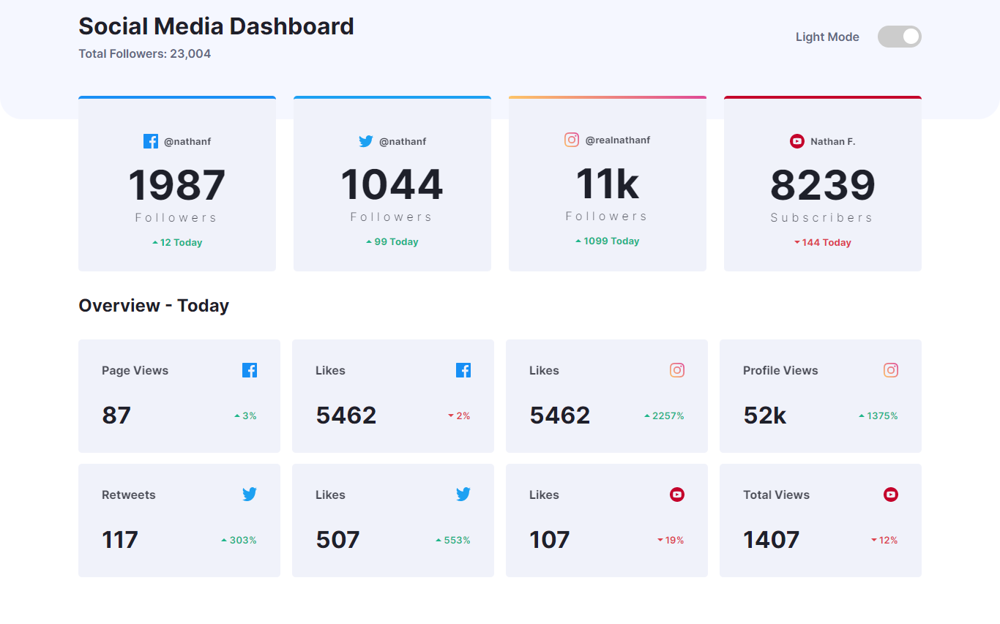
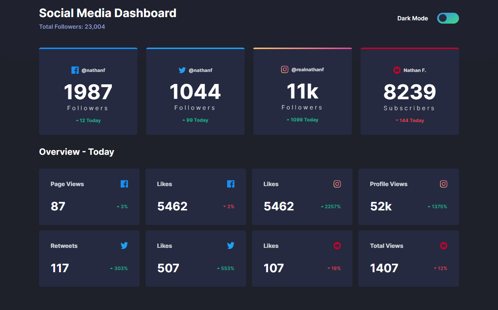
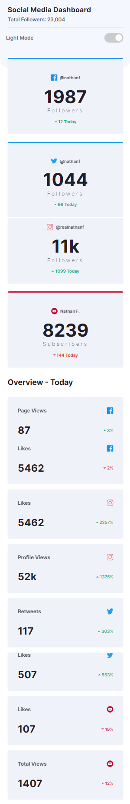
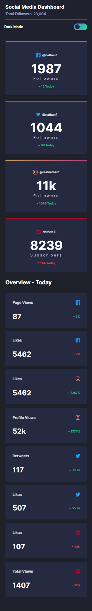

# Social media dashboard with theme switcher solution

 

## Table of contents

- [Social media dashboard with theme switcher solution](#social-media-dashboard-with-theme-switcher-solution)
  - [Table of contents](#table-of-contents)
  - [Overview](#overview)
    - [The challenge](#the-challenge)
    - [Links](#links)
    - [Screenshot](#screenshot)
  - [My process](#my-process)
    - [Built with](#built-with)
    - [What I learned](#what-i-learned)
    - [Run the project](#run-the-project)
    - [Useful resources](#useful-resources)
  - [Author](#author)

## Overview

### The challenge

Users should be able to:

- View the optimal layout for the site depending on their device's screen size
- See hover states for all interactive elements on the page
- Toggle color theme to their preference

### Links

- Solution URL: [Add solution URL here](https://your-solution-url.com)
- Live Site URL: [Add live site URL here](https://your-live-site-url.com)

### Screenshot






## My process

### Built with

- Semantic HTML5 markup
- CSS custom properties
- Flexbox
- CSS Grid
- Javascript ES6+

### What I learned

- How to create a UI with theme switcher
- persiste data in local storage
  
### Run the project

To run this project simply install node dependencies and run sass, see below:

```shell
   npm install 
```

add to command in your package.json

```shell
"sass": "sass --watch scss/main.scss:dist/css/main.css"
```

then run a this command to watch sass

```shell
   npm run sass
```

### Useful resources

- [How To Create Toggle Switch](https://www.w3schools.com/howto/howto_css_switch.asp) - This is a great guide that teach you how to create a theme toggler
- [how to use localStorage on your project](https://developer.mozilla.org/en-US/docs/Web/API/Window/localStorage) - A well explained tutorial about **localStorage**

## Author

- Github [@mounir-m4](https://github.com/mounir-m4)
- Twitter - [@mounirmotawakil](https://twitter.com/mounirmotawakil)
- Frontend Mentor - [@mounir-m4](https://www.frontendmentor.io/profile/mounir-m4)